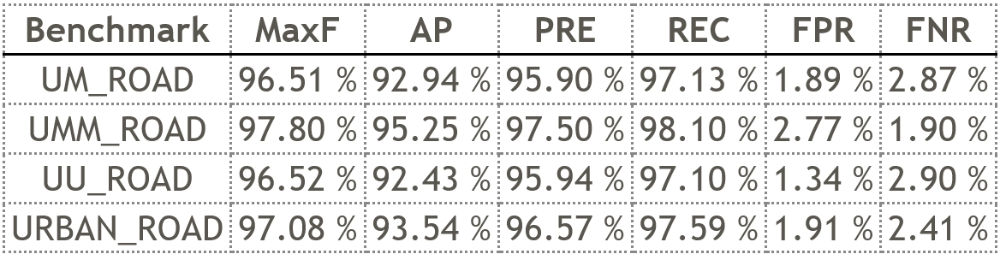

[](https://opensource.org/licenses/Apache-2.0)
[](https://pytorch.org/)

This repo contains the official implementation of the **T-ITS 2025** paper, road segmentation with both fast speed and state-of-the-art accuracy.

<div align="center">
<h1>
<b>
Evidence-based Real-time Road Segmentation with RGB-D Data Augmentation 
</b>
</h1>
<h4>
<b>
Feng Xue, Yicong Chang, Wenzhuang Xu, Wenteng Liang, Fei Sheng, Anlong Ming
    
Beijing University of Posts and Telecommunications
</b>
</h4>
</div>


# Evi-RoadSeg

This repository provides the implementation of Evi-RoadSeg in PyTorch, which is extended from [USNet](https://github.com/morancyc/USNet). **The code and model for all datasets will be released as soon as the paper is accepted.**

The network structure of Evi-RoadSeg is shown as follows:

<p align="center">

</p>

The training set is augmented is shown as follows:

<p align="center">

</p>

Here shows the segmentation result on KITTI dataset:

<p align="center">

</p>


## Data Preparation


#### KITTI Road Dataset

You may download the original images and annotations of on KITTI Road dataset from [KITTI](http://www.cvlibs.net/datasets/kitti/eval_road.php) and the depth images can be found in [SNE-RoadSeg](https://github.com/hlwang1124/SNE-RoadSeg).
Then please setup dataset according to the following directory structure:
```
USNet
 |-- data
 |  |-- KITTI
 |  |  |-- training
 |  |  |  |-- calib
 |  |  |  |-- depth_u16
 |  |  |  |-- gt_image_2
 |  |  |  |-- image_2
 |  |  |-- validating
 |  |  |  |-- calib
 |  |  |  |-- depth_u16
 |  |  |  |-- gt_image_2
 |  |  |  |-- image_2
 |  |  |-- testing
 |  |  |  |-- calib
 |  |  |  |-- depth_u16
 |  |  |  |-- image_2
 |-- models
 ...
```

#### Ready to drive (R2D) Dataset

You may download the original images and annotations from [here](https://sites.google.com/view/sne-roadseg/dataset?authuser=0). Then please setup dataset according to the [official split](https://github.com/hlwang1124/SNE-RoadSeg/issues/2) and the following directory structure:
```
USNet
 |-- data
 |  |-- R2D
 |  |  |-- training
 |  |  |  |-- Town02   |-- depth
 |  |  |               |-- label
 |  |  |               |-- rgb
 |  |  |  |-- Town03
 |  |  |  |-- Town04
 |  |  |  |-- Town05
 |  |  |-- validation
 |  |  |  |-- Town01
 |  |  |  |-- Town05
 |  |  |-- testing
 |  |  |  |-- Town05
 |  |  |  |-- Town06
 |-- models
 ...
```

#### ORFD Dataset

You may download the original images and annotations from [here](https://pan.baidu.com/s/1DiHrrY2-FXab2EED5J5m4g). Then please setup dataset according to the following directory structure:
```
USNet
 |-- data
 |  |-- ORFD
 |  |  |-- training
 |  |  |  |-- sequence   |-- calib
 |  |  |                 |-- sparse_depth
 |  |  |                 |-- dense_depth
 |  |  |                 |-- lidar_data
 |  |  |                 |-- image_data
 |  |  |                 |-- gt_image
 ......
 |  |  |-- validation
 ......
 |  |  |-- testing
 ......
 |-- models
 ...
```


## Installation
The code is developed using Python 3.7 with PyTorch 1.6.0.
The code has been verified on NVIDIA GTX 1080Ti GPUs and NVIDIA RTX 3090 GPU card.
You can create a conda environment and install the required packages by running:

```
$ conda create -n usnet python=3.7
$ pip install -r requirements.txt
```


## Testing

Please ensure that the checkpoint exists in `weight`.
You can download the pre-trained models from [google drive](https://drive.google.com/drive/folders/1ujelTK_sqe4DDfpn_alXKz1g1T6hO_6c?usp=sharing) and `unzip` the corresponding compressed file.
The parameter files should be put in to `weight` folder.

> Before testing,
you need to config the **necessary paths or variables** in `test_kitti_bev.py` or `test_others.py`:
```
params = [
'--dataset', 'orfd', # change it to the dataset you want to test
'--data', '/data/ORFD', # change it to your dataset path
'--num_classes', '2',
'--cuda', '0',
'--context_path', 'resnet18',
'--checkpoint_path', 'weight/orfd/best_model.pth', # change it to your parameter path
'--save_path', 'result/test' # change it to your custom path
]
```

> Then, please select the **input resolution** according to the datasets:

```
## Cityscapes
# parser.add_argument('--crop_height', type=int, default=512, help='Height of cropped/resized input image to network')
# parser.add_argument('--crop_width', type=int, default=1024, help='Width of cropped/resized input image to network')

## ORFD
# parser.add_argument('--crop_height', type=int, default=480, help='Height of cropped/resized input image to network')
# parser.add_argument('--crop_width', type=int, default=640, help='Width of cropped/resized input image to network')

## R2D
# parser.add_argument('--crop_height', type=int, default=704, help='Height of cropped/resized input image to network')
# parser.add_argument('--crop_width', type=int, default=1280, help='Width of cropped/resized input image to network')
```

To run the test on ORFD, R2D, or Cityscapes dataset:
```
$ python test_others.py
```


To run the test on Kitti dataset:
```
$ python test_kitti_bev.py
```
This python file `python test_kitti_bev.py` will create a `result` folder in the root.
Uploading the `result/kitti` images on the Kitti benchmark website, you will get the number as below:
<p align="center">

</p>


## Training

**Before training**,
please download the files for **RGBD data augmentation** from [google drive](https://drive.google.com/file/d/1z7AYE17qI8BtOJGxzMUaBs-rdTzHX04k/view?usp=sharing) and **shadow** files from [google drive](https://drive.google.com/file/d/17IVBmPhMX-6fzOviXvwk6WdKpF6QjK61/view?usp=sharing).
Then, please put `RGBD_DA_files` folder in the root path and `shadow` folder in the KITTI root path.


For training USNet on KITTI Road dataset, you can run:

```
$ cd $EVIROADSEG_ROOT
$ python train_kitti.py
$ python train_orfd.py
$ python train_r2d.py
$ python train_cityscapes.py
```
When training completed, the checkpoint will be saved to `./weight`.


## If you find our work is useful, pleaes cite our paper:
```
@ARTICLE{xue2025evi,
  author={Xue, Feng and Chang, Yicong and Xu, Wenzhuang and Liang, Wenteng and Sheng, Fei and Ming, Anlong},
  journal={IEEE Transactions on Intelligent Transportation Systems}, 
  title={Evidence-Based Real-Time Road Segmentation With RGB-D Data Augmentation}, 
  year={2025},
  volume={26},
  number={2},
  pages={1482-1493}
}
```

## ⭐ Related Works ⭐
<table>
  <thead align="center">
    <tr>
      <td><b>Projects 🛠️</b></td>
      <td><b>Publication 📰</b></td>
      <td><b>Content 📝</b></td>
    </tr>
  </thead>
  <tbody>
    <tr>
      <td colspan="3" align="center"><b>Road Segmentation 🛣️</b></td>
    </tr>
    <tr>
      <td><a href="https://github.com/xuefeng-cvr/Evi-RoadSeg"><b>Evidence-based RGB-D Road Segmentation【基于证据理论可行域分割】</b></a></td>
      <td><b>T-ITS 2025</b></td>
      <td><b>Code</b></td>
    </tr>
    <tr>
      <td><a href="https://github.com/morancyc/USNet"><b>Uncertainty-aware Fast Road Segmentation【首个不确定性引导融合的可行域分割】</b></a></td>
      <td><b>ICRA 2022</b></td>
      <td><b>Code</b></td>
    </tr>
    <tr>
      <td><a href="https://github.com/zhouhuan-hust/LFD_RoadSeg"><b>Low-level Ultra-Fast Road Segmentation【最快的可行域分割】</b></a></td>
      <td><b>T-ITS 2024</b></td>
      <td><b>Code</b></td>
    </tr>
    <tr>
      <td><a href="https://github.com/gongshichina/FastRoadSeg"><b>Fast Monocular Road Segmentation【超快单目可行域分割】</b></a></td>
      <td><b>T-ITS 2022</b></td>
      <td><b>Code</b></td>
    </tr>
    <tr>
      <td colspan="3" align="center"><b>Visual Anomaly Detection/Discovery for Robots or Vehicles 🔍</b></td>
    </tr>
    <tr>
      <td><a href="https://github.com/xuefeng-cvr/IndoorObstacleDiscovery-RG"><b>Reflective Ground Object Discovery【首个反光地面障碍物检测方法与数据集】</b></a></td>
      <td><b>IJCV 2023</b></td>
      <td><b>Code, Dataset</b></td>
    </tr>
    <tr>
      <td><a href="https://github.com/Went-Liang/UnSniffer"><b>Generalized Unknown Object Sniffer【解决对未知物体检测精确度的忽视】</b></a></td>
      <td><b>CVPR 2023</b></td>
      <td><b>Code, Dataset</b></td>
    </tr>
    <tr>
      <td><a href="https://github.com/xuefeng-cvr/Tiny-Obstacle-Discovery-ROS"><b>Tiny Obstacle Discovery【超小障碍物检测算法】</b></a></td>
      <td><b>ICRA 2019, TIP 2020</b></td>
      <td><b>Code</b></td>
    </tr>
    <tr>
      <td colspan="3" align="center"><b>Monocular Depth Estimation 📏</b></td>
    </tr>
    <tr>
      <td><a href="https://github.com/1hao-Liu/SM4Depth"><b>Seamless Monocular Depth Estimation【首个无缝单目深度估计算法】</b></a></td>
      <td><b>ACMMM 2024</b></td>
      <td><b>Code, Dataset</b></td>
    </tr>
    <tr>
      <td><a href="https://github.com/YiLiM1/DANet"><b>Depth Distribution Alignment【解决轻量化模型的度量分布不对齐】</b></a></td>
      <td><b>ICRA 2022</b></td>
      <td><b>Code</b></td>
    </tr>
    <tr>
      <td><a href="https://github.com/xuefeng-cvr/BS-Net"><b>Boundary-induced and scene-aggregated depth estimation</b></a></td>
      <td><b>PR 2021</b></td>
      <td><b>Code</b></td>
    </tr>
  </tbody>
</table>

## Acknowledgement
The source code of surface normal estimator in our method follows [SNE-RoadSeg](https://github.com/hlwang1124/SNE-RoadSeg), we do appreciate this great work. Besides, the code of acquiring uncertainty in our method is adapted from [TMC](https://github.com/hanmenghan/TMC).
