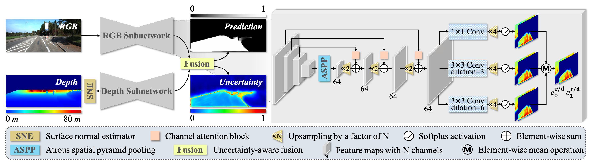
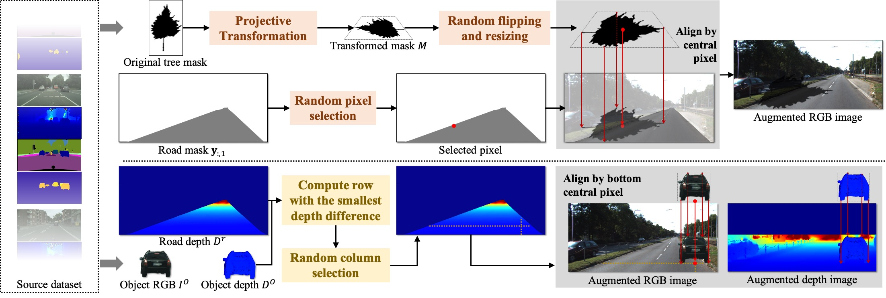

# Evi-RoadSeg
Code for paper: "Evidence-based Real-time Road Segmentation with RGB-D Data Augmentation" (road segmentation with both fast speed and state-of-the art accuracy)

This repository provides the implementation of Evi-RoadSeg in PyTorch, which is extended from [USNet](https://github.com/morancyc/USNet).

The network structure of Evi-RoadSeg is shown as follows:

<p align="center">

</p>

The training set is augmented is shown as follows:

<p align="center">

</p>

Here shows the segmentation result on KITTI dataset:

<p align="center">

</p>


## Data Preparation


#### KITTI Road Dataset

You may download the original images and annotations of on KITTI Road dataset from [KITTI](http://www.cvlibs.net/datasets/kitti/eval_road.php) and the depth images can be found in [SNE-RoadSeg](https://github.com/hlwang1124/SNE-RoadSeg). Then please setup dataset according to the following directory structure:
```
USNet
 |-- data
 |  |-- KITTI
 |  |  |-- training
 |  |  |  |-- calib
 |  |  |  |-- depth_u16
 |  |  |  |-- gt_image_2
 |  |  |  |-- image_2
 |  |  |-- validating
 |  |  |  |-- calib
 |  |  |  |-- depth_u16
 |  |  |  |-- gt_image_2
 |  |  |  |-- image_2
 |  |  |-- testing
 |  |  |  |-- calib
 |  |  |  |-- depth_u16
 |  |  |  |-- image_2
 |-- models
 ...
```

#### Ready to drive (R2D) Dataset

You may download the original images and annotations from [here](https://sites.google.com/view/sne-roadseg/dataset?authuser=0). Then please setup dataset according to the [official split](https://github.com/hlwang1124/SNE-RoadSeg/issues/2) and the following directory structure:
```
USNet
 |-- data
 |  |-- R2D
 |  |  |-- training
 |  |  |  |-- Town02   |-- depth
 |  |  |               |-- label
 |  |  |               |-- rgb
 |  |  |  |-- Town03
 |  |  |  |-- Town04
 |  |  |  |-- Town05
 |  |  |-- validation
 |  |  |  |-- Town01
 |  |  |  |-- Town05
 |  |  |-- testing
 |  |  |  |-- Town05
 |  |  |  |-- Town06
 |-- models
 ...
```

#### ORFD Dataset

You may download the original images and annotations from [here](https://pan.baidu.com/s/1DiHrrY2-FXab2EED5J5m4g). Then please setup dataset according to the following directory structure:
```
USNet
 |-- data
 |  |-- ORFD
 |  |  |-- training
 |  |  |  |-- sequence   |-- calib
 |  |  |                 |-- sparse_depth
 |  |  |                 |-- dense_depth
 |  |  |                 |-- lidar_data
 |  |  |                 |-- image_data
 |  |  |                 |-- gt_image
 ......
 |  |  |-- validation
 ......
 |  |  |-- testing
 ......
 |-- models
 ...
```


## Installation
The code is developed using Python 3.7 with PyTorch 1.6.0. The code is tested using one NVIDIA 1080Ti GPU card.
You can create a conda environment and install the required packages by running:
```
$ conda create -n usnet python=3.7
$ pip install -r requirements.txt
```


## Training

For training USNet on KITTI Road dataset, you can run:

```
$ cd $EVIROADSEG_ROOT
$ python train.py
```
When training completed, the checkpoint will be saved to `./log/KITTI_model`.


## Testing

**Note that** before testing you need to config the necessary paths or variables. Please ensure that the checkpoint exists in `checkpoint_path`.

To run the test on KITTI Road dataset:
```
$ python test.py
```


## Acknowledgement
The source code of surface normal estimator in our method follows [SNE-RoadSeg](https://github.com/hlwang1124/SNE-RoadSeg), we do appreciate this great work. Besides, the code of acquiring uncertainty in our method is adapted from [TMC](https://github.com/hanmenghan/TMC).
